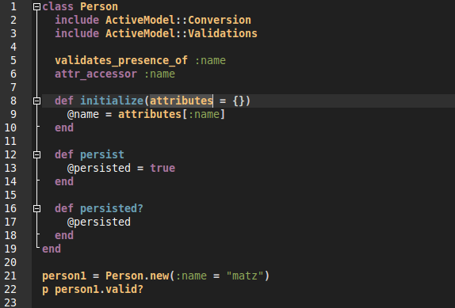

# Base16 for Geany

[Geany](http://geany.org) is a text editor using the GTK2 toolkit with basic
features of an integrated development environment. This is a
[Tinted](https://github.com/tinted-theming/home) Base16 scheme for it, built using the [Tinted Builder Rust](https://github.com/tinted-theming/tinted-builder-rust).




## Installation

1. Copy the files to your `~/.config/geany/colorschemes` directory.
2. Choose the scheme at View -> Editor -> Color Schemes.


## Building

1. Download the Geany scheme
  ```bash
  git clone https://github.com/RobLoach/tinted-geany.git
  cd tinted-geany
  ```

2. Install [tinted-builder-rust](https://github.com/tinted-theming/tinted-builder-rust)

3. Run it...
  ```bash
  tinted-builder-rust sync
  tinted-builder-rust build .
  ```


## License

[MIT License](https://github.com/robloach/base16-geany/blob/master/LICENSE.md)
